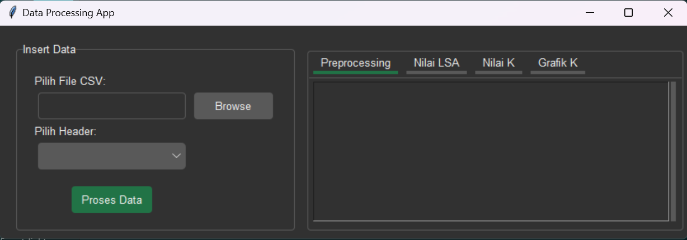
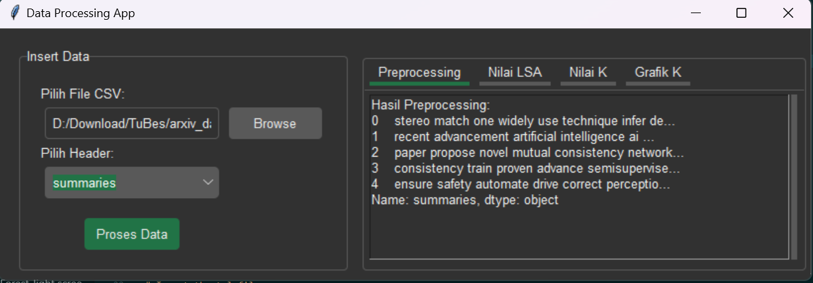
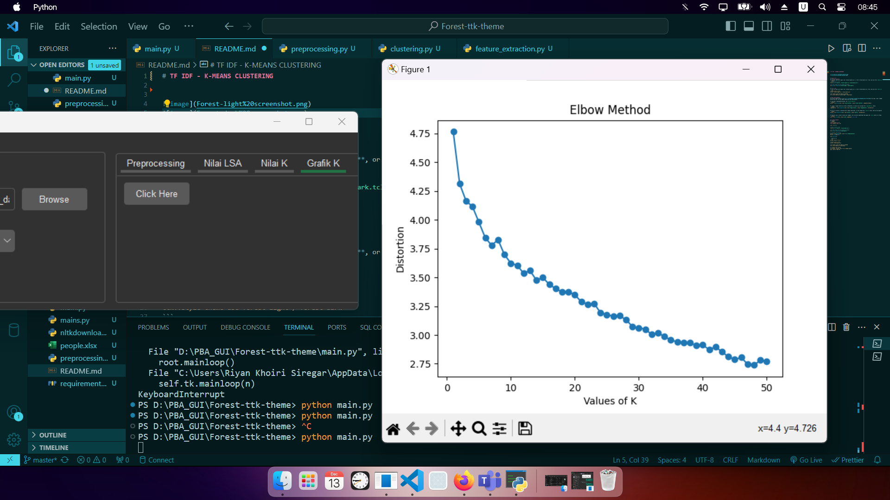

# TF IDF - K-MEANS CLUSTERING








## Setup
Clone this repo 
```clone
git clone https://github.com/riyanks/TF-IDF-ft-K-Means-Clustering.git
```
### Installation 
Open terminal in your directory and install the dependency :
```install
pip install -r requirements.txt
```
after installation, run this file to download nltk library 
```nltk
python nltkdownloader.py
```
### Run App
Open your terminal directory and run this command :
```run
python main.py
```
